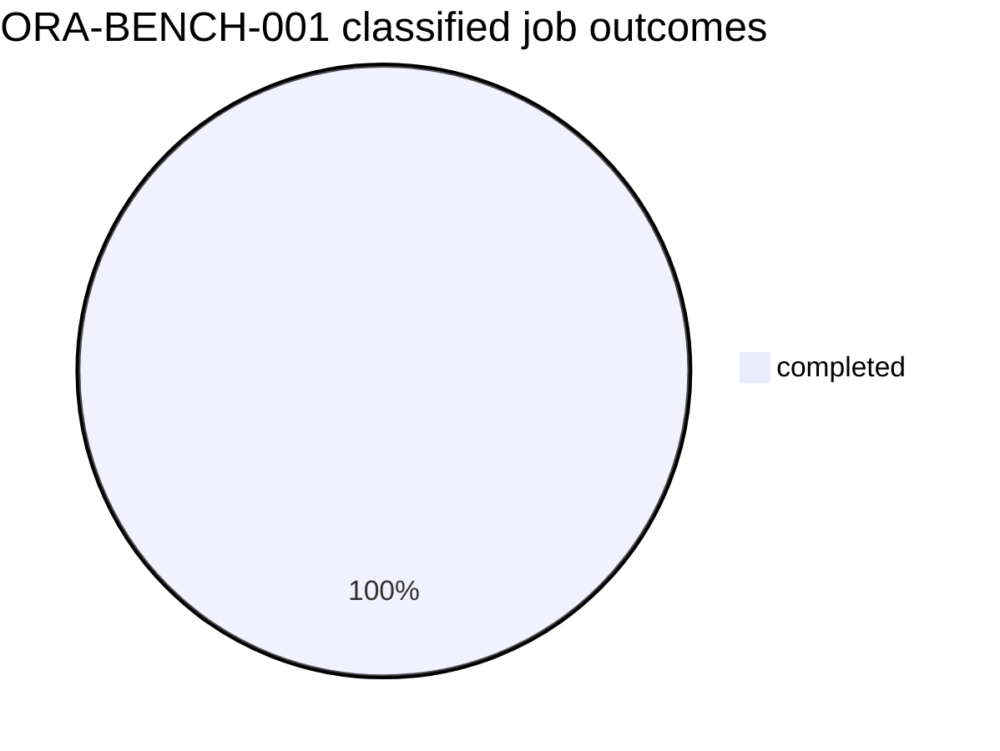

# ORA-BENCH-001 benchmark graph

- Status: `completed`
- Mode: `full`
- Scheduled evaluations represented: `250000`
- Hidden catalogue: revealed after result freeze

```mermaid
flowchart LR
    freeze((P09 freeze)) --> preflight((P10 preflight))
    preflight --> train((train methods A-E))
    train --> evaluate((hidden evaluation))
    evaluate --> freeze_results((freeze results))
    freeze_results --> reveal((reveal hidden catalogue))
    reveal --> analyse((statistical analysis))
    analyse --> graph((GitHub graph))
    graph --> gate((GATE-P11 interpretation))
    gate -. future benchmark change .-> freeze
```


